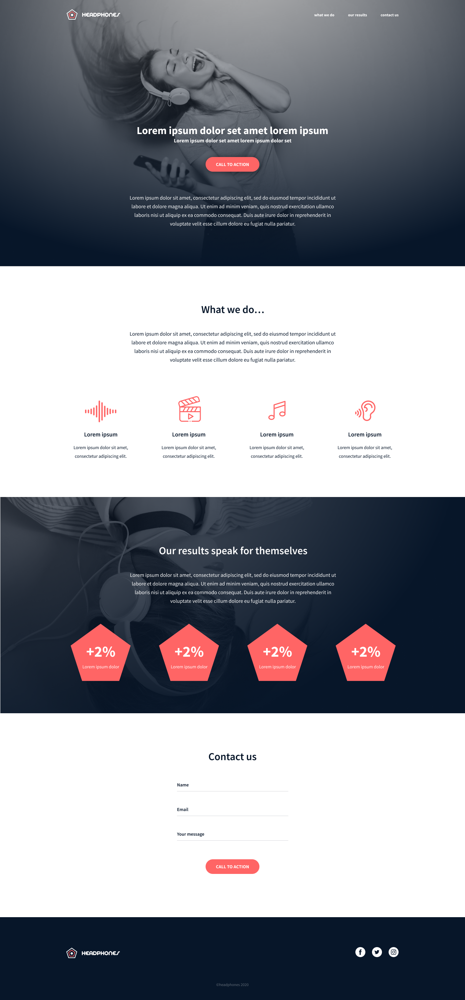

# Headphones

This repository focuses on implementing a full webpage based on a Figma file.

  

## Description

The project aims at implementing a webpage from scratch and without any library, using pure HTML/CSS only.

## Requirements

- mobile breakpoint: 480px
- tablet breakpoint: 768px
- hover/active links: color #FF6565
- hover/active buttons: opacity 0.9
- max width of content: 1000px centered

## Structure

* [assets/](https://github.com/gwendalminguy/holbertonschool-headphones/tree/main/assets), the directory containing images and fonts.

* [*-index.html](https://github.com/gwendalminguy/holbertonschool-headphones/tree/main/4-index.html), the HTML file containing the structure of the web page.

* [*-styles.css](https://github.com/gwendalminguy/holbertonschool-headphones/tree/main/4-styles.css), the CSS file containing the styles of the web page.
